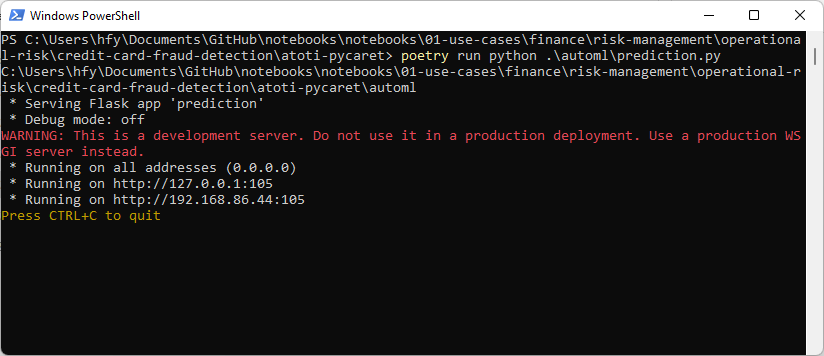
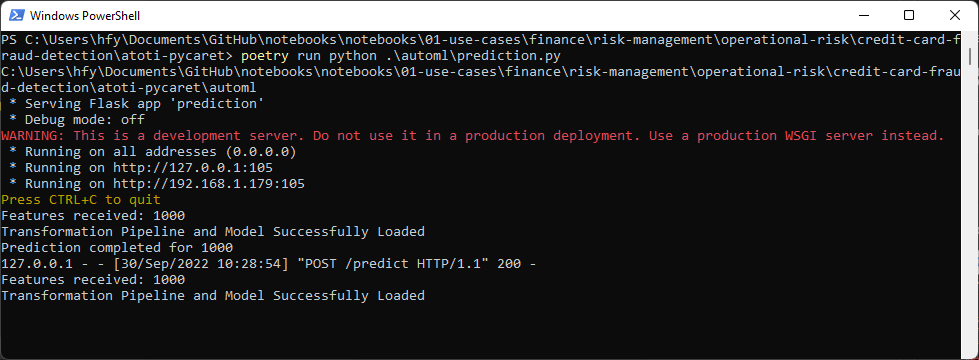

# Endpoint for Credit Card Fraud prediction

The package automl consists of machine learning models that we have trained using [PyCaret](https://pycaret.org/).

By creating a small [Flask application](https://flask.palletsprojects.com/en/2.2.x/), we are able to create an endpoint that takes in the features for the model to perform fraud prediction.

# Installation

Extract the contents from within `source.zip` and change directory to the extracted `source` folder.

We can use either `uv` or `Docker` to build and run our application.

## uv

Set up the virtual environment and dependencies for the project using the below command:

💡 **Note:** If using uv in a Windows environment, it is recommended to use Python 3.8 due to llvmlite and numpy requirements for PyCaret.

```
uv sync --python 3.8
```

To launch the Flask application, run the following command:

```
uv run python .\automl\prediction.py
```

Refer to the [uv documentation](https://docs.astral.sh/uv/) for more information on the package manager.

## Docker

Execute the following commands to build a Docker container and run `PyCaret` from within a Docker container:

```bash
docker build -f Dockerfile -t atoti-pycaret .
docker run -it -p 105:105 atoti-pycaret
```

## Runtime

You should able to see the following:



We can post requests to the endpoint at http://127.0.0.1:105/predict, e.g.  

```
def get_prediction(features_df):
    url = "http://127.0.0.1:105/predict"
    header = {"Content-Type": "application/json"}

    payload = {
        "features": features_df.to_json(orient="records"),
    }

    try:
        response = requests.post(url, json=payload)

        prediction = pd.DataFrame.from_dict(response.json())
        return prediction

    except requests.exceptions.HTTPError as e:
        print(e.response.text)
```

You can verify that the requests are received by the endpoint through the shell running this program:

  

The endpoint returns a Pandas DataFrame containing the features and their corresponding prediction.
