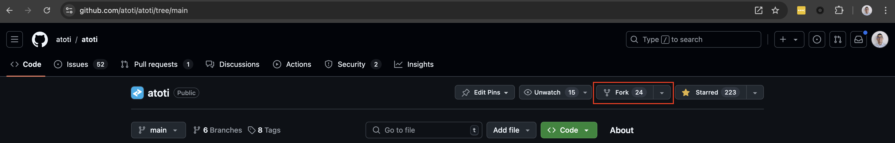

## Getting started

We welcome any contributions from the community!

 To get started, please proceed to...

1. [Fork](https://docs.github.com/en/get-started/quickstart/fork-a-repo) the Atoti repository:

    

2. Clone the forked repository and ensure latest changes from the `main` branch.

    * `git checkout main`
    * `git pull`

3. Run `uv sync --python 3.10` to install dependencies from the `uv.lock` file.
4. Create a working branch `git switch -c <BRANCH_NAME>`.
5. Start JupyterLab: `uv run jupyter-lab`.
6. Create the folder and notebooks.

    * Add notebooks responsible for data pre-processing to the [list of untested notebooks](tests/test_notebooks.py).
    * The main notebook using atoti should be tested to ensure users can run it.

7. If a dependency is missing run `uv add <DEPENDENCY_NAME>`. 

    * **DEPENDENCIES MUST NOT BEEN ADDED WITH CONDA OR PIP** since the Github CI relies on the `uv.lock` file to install dependencies.

8. Commit and push changes to the forked repository using `git push`.
9. Create a [pull request](https://docs.github.com/en/pull-requests/collaborating-with-pull-requests/proposing-changes-to-your-work-with-pull-requests/about-pull-requests) from the forked repository.

Please monitor the pull request as each pull request is subject to automatic code testing. The Atoti team will review and comment on any pull requests to ensure each submission is aligned with the API's usage.


## Pull Request Rules

Please make sure your PR follows the rules below:

### General notebook rules

* Folders and files name should be lowercase with hyphen.

  * E.g. `name-of-my-folder-or-file`

* Notebook example should be put inside a folder which name is the notebook's title. This folder should be located under a specific "domain" folder.

  * E.g. `/relevant-domain/title-of-my-notebook-folder/`

* Entrypoint should be named `main.ipynb`
* README TOC should be updated to link to the new notebook
* Notebook should have an H1 title, matching folder name and README TOC
* Create a README at notebook level to briefly introduce yourself and the use case.

### Data rules

* Data files name should use snake_case
* Data files should be of reasonable size, not exceeding 50MB, unless programmatically generated
* All data files should be uploaded on data.atoti.io If you don't have access to it, data should be hosted on a public host and an owner will transfer them to data.atoti.io upon review

### Python code rules

* Variables should follow Google's [naming convention](http://google.github.io/styleguide/pyguide.html#316-naming).
* Python files should be formatted with [Ruff](https://docs.astral.sh/ruff/).
* Python methods should be typed.
* Documentation should follow Google's [docstring](http://google.github.io/styleguide/pyguide.html#381-docstrings).

### Formatting, testing, and upgrading


These commands can be used while developing:

* Reformat python files using `ruff`:

  ```text
  make format
  ```

* Test all notebooks:

  ```text
  make test
  ```

* Render all notebook cells:

  ```text
  make render
  ```

* Upgrade all notebooks (test and render):

  ```text
  make upgrade
  ```

## CI/CD

This repository uses a [Github Action workflow](.github/workflows/test.yaml) to test notebooks. Test reports are generated and uploaded to the summary view of every workflow run.

### About

Check out [atoti.io](https://www.atoti.io) for more info!

By opening an issue or a pull request, you agree with Atoti's [terms of use](https://www.atoti.io/terms) and [privacy policy](https://www.atoti.io/privacy-policy).
