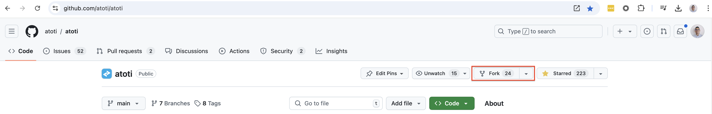

## Getting started

We welcome any contributions from the community!

 To get started, please proceed to...

1. [Fork](https://docs.github.com/en/get-started/quickstart/fork-a-repo) the Atoti repository:

    

2. Clone the forked repository and ensure latest changes from the `main` branch.

    * `git checkout main` and `git pull`.

3. Install dependencies from the `uv.lock` file.

    * `uv sync --python 3.10`

4. Create a working branch.

    * `git checkout -b <BRANCH_NAME>` or `git switch -c <BRANCH_NAME>`.

5. Start JupyterLab using `uv`.

    * `uv run jupyter-lab`

6. Create the folder and notebooks.

    * Make sure to add any notebooks responsible for data pre-processing to the [list of untested notebooks](tests/test_exclusion.txt).
    * Notebooks using Atoti should be tested to ensure users can run it.

7. If a dependency is missing run `uv add <DEPENDENCY_NAME>`. 

    * **DEPENDENCIES MUST NOT BEEN ADDED WITH CONDA OR PIP** since the Github CI relies on the `uv.lock` file to install dependencies.

8. Commit and push changes to the forked repository using `git push`.
9. Create a [pull request](https://docs.github.com/en/pull-requests/collaborating-with-pull-requests/proposing-changes-to-your-work-with-pull-requests/about-pull-requests) from the forked repository.

Please monitor the pull request as each pull request is subject to automatic code testing. The Atoti team will review and comment on any pull requests to ensure each submission is aligned with the API's usage.


## Pull Request Rules

Please make sure your PR follows the rules below:

### General notebook rules

* Folders and file names should be lowercase with hyphens.

  * E.g. `name-of-my-folder-or-file`

* Notebook examples should reside within folders whose names represent the notebook's title or idea. Each notebook folder should reside within a "domain" folder, such as `01-atoti-academy`, `02-technical-guides`, or `03-use-cases`.

  * E.g. `/domain/notebook-folder/`

* Individual `.ipynb` files within a notebook folder should be named `main.ipynb`.

  * E.g. `/domain/notebook-folder/main.ipynb`

* README table of contents should be updated to link to the new notebook.
* Notebook should have an `H1` title, matching folder name and README table of contents.
* Create a README within notebook folders to briefly introduce the use case.

### Data rules

* Data file names should use `snake_case`.
* Data files should be of reasonable size, not exceeding 50MB, unless programmatically generated.
* All data files should be uploaded on `data.atoti.io`. If you don't have access to it, data should be hosted on a public host and an owner will transfer them to `data.atoti.io` upon review.

### Python code rules

* Variables should follow Google's [naming convention](http://google.github.io/styleguide/pyguide.html#316-naming).
* Python files should be formatted with [Ruff](https://docs.astral.sh/ruff/).
* Python methods should be typed.
* Documentation should follow Google's style guide for [docstrings](http://google.github.io/styleguide/pyguide.html#381-docstrings).

### Formatting, testing, and upgrading

A Makefile is a type of script used to by the [make](https://www.gnu.org/software/make/) utility to automate repetitive tasks. This repository uses the following [Makefile](Makefile) to automate common tasks:

* Format code in notebooks using the [ruff formatter](https://docs.astral.sh/ruff/formatter/).

  ```text
  make format
  ```

* Test code in notebooks with [pytest](https://docs.pytest.org/en/stable/) using the [nbmake](https://github.com/treebeardtech/nbmake) Pytest plugin.

  ```text
  make test
  ```

* Execute code in notebooks and render web-based JupyterLab widgets using [jupyterlab](https://jupyterlab.readthedocs.io/en/latest/) and the browser automation tool [playwright](https://playwright.dev/python/).

  ```text
  make render
  ```

* Upgrade all notebooks using a combination of `make test` and `make render`.

  ```text
  make upgrade
  ```

## CI/CD

[GitHub Actions](https://docs.github.com/en/actions/about-github-actions/understanding-github-actions) is GitHub’s built-in continuous integration and continuous deployment (CI/CD) platform that allows for defining workflows as YAML files. This repository uses the following [Github Action workflow](.github/workflows/test.yaml) to test the notebooks. Test reports are generated and uploaded to the summary view of every workflow run.

### About

Check out [atoti.io](https://www.atoti.io) for more info!

By opening an issue or a pull request, you agree with Atoti's [terms of use](https://www.atoti.io/terms) and [privacy policy](https://www.atoti.io/privacy-policy).
