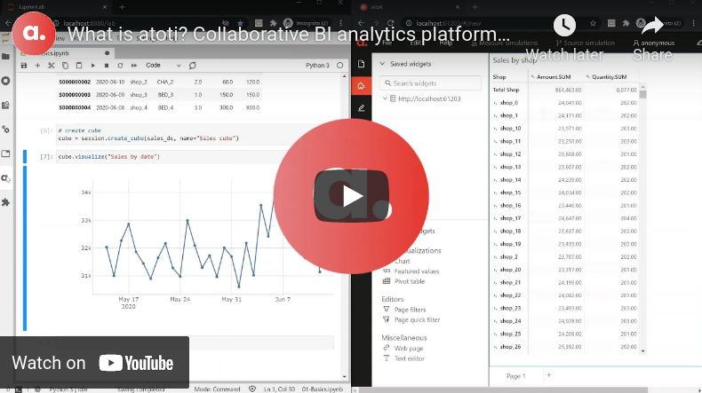

<p align="center">
  
</p>

<p align="center">
  <a href="https://gitter.im/atoti/atoti"></a>
  <a href="https://hits.seeyoufarm.com"></a>
  <a href="https://stackoverflow.com/questions/tagged/atoti"></a>
</p>

### 🔍 Overview

atoti is a free Python BI analytics platform for Quants, Data Analysts, Data Scientists & Business Users to collaborate better, analyze faster and translate their data into business KPIs.

<p align="center">
    <a href="https://www.youtube.com/watch?v=KNvheH-ifAI" target="_blank"></a>
</p>

Checkout [atoti.io](https://www.atoti.io) for more info!

### 🔭 Highlights

- Analyze millions of rows on your laptop and up to several terabytes in the cloud
- Create what-if scenarios and compare them side by side
- Enable multi-dimensional analysis with OLAP cubes
- Visualize data in interactive widgets without coding from Jupyter notebook
- Share results with peers and partners
- Explore data from atoti’s dashboarding web application or Excel

### 🧰 Installation

Python package [(docs)](https://docs.atoti.io/latest/installation.html#python-package):

```console
> pip install atoti[jupyterlab]
```

Conda package [(docs)](https://docs.atoti.io/latest/installation.html#conda-package):

```console
> conda install atoti atoti-jupyterlab python -c conda-forge -c https://conda.atoti.io
```

Docker image [(docs)](https://docs.atoti.io/latest/installation.html#docker-image):

```console
> docker pull atoti/atoti
```

### 🎫 Issues

You may:

- Check out [existing issues](https://github.com/atoti/atoti/issues).
- Create a [new issue](https://github.com/atoti/atoti/issues/new/choose)

By opening an issue or a pull request, you agree with atoti's [terms of use](https://www.atoti.io/terms) and [privacy policy](https://www.atoti.io/privacy-policy).

### 📚 Resources

- [Tutorial](https://docs.atoti.io/latest/tutorial/tutorial.html)
- [Notebooks Gallery](https://github.com/atoti/notebooks)
- [Guides](https://www.atoti.io/atoti-starting-guides/)
- [Articles](https://www.atoti.io/articles/)
- [Videos](https://www.atoti.io/resources/videos/)
